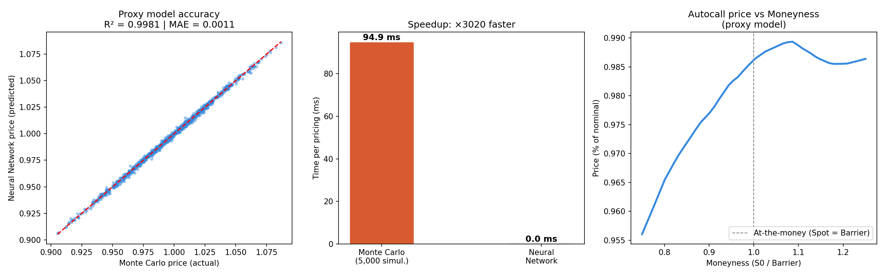

# Autocall Athena — Neural Network Proxy Pricing Model

Pricing a structured product via Monte Carlo takes ~100ms per computation.
This project trains a neural network to replicate the pricer — 
same accuracy, 3,000x faster.

## Results

| Metric | Value |
|---|---|
| R² (out-of-sample) | 0.9981 |
| Mean Absolute Error | 0.11% of nominal |
| Monte Carlo time | 93.9 ms |
| Neural Network time | 0.028 ms |
| Speedup | ×3,396 |

## Stack

Python · PyTorch · Scikit-learn · NumPy · Pandas · Matplotlib

## Structure

- `autocall_mc.ipynb` — full notebook (MC pricer + dataset + MLP + results)
- `dataset_autocall.csv` — 5,000 generated market scenarios
- `resultats_finaux.png` — performance charts
